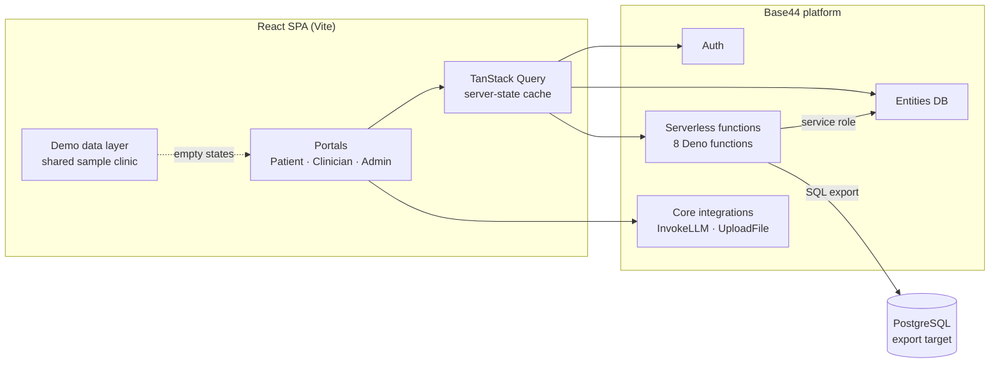

<div align="center">

# 🗣️ Nuara

**A white-labelled home-practice platform for speech-language pathology (SLP) clinics.**


**[▶️ Watch the demo](https://youtu.be/J8V_Hfshahs)**

</div>

---

Most speech therapy progress happens between sessions, at home, where clinicians have no visibility. Nuara lets clinicians assign structured homework, lets patients and caregivers submit their practice, and gives clinics analytics on how treatment is going outside the clinic.

## 📑 Table of Contents

- [Architecture](#️-architecture)
- [Design Decisions](#-design-decisions)
- [Challenges](#-challenges)
- [Features](#-features)
- [Tech Stack](#-tech-stack)
- [Project Structure](#-project-structure)
- [Getting Started](#-getting-started)

## 🏗️ Architecture



- **Frontend:** a React 18 single-page app with three portals (patient/caregiver, clinician, admin), gated by `AuthGuard` / `ProtectedRoute`. TanStack Query handles fetching and caching.
- **Core data:**
  - **Care team:** `User`, `PractitionerPatientAssignment`
  - **Homework:** `TherapyPlan` (a day-by-day plan of exercises), `TherapyLog` (patient submissions), `TherapyActivity` (resource library)
  - **Outcomes:** `TherapyGoal`, `ProgressMetric`, `ClinicalNote`
  - **Practice config:** `PracticeSettings`
- **White-labelling:** each clinic configures its practice name, contact details, timezone, default session length and frequency, compliance target, alert and parent-email preferences, and which clinical categories it offers (articulation, language, fluency, voice, listening, social, cognitive).
- **Backend functions:** 8 Deno serverless functions for privileged work: adding clients, inviting users, sending announcements, computing admin dashboard metrics, generating progress reports, syncing clinician assignments, and exporting the database to PostgreSQL.

## 🧠 Design Decisions

- **Homework as structured data, not free text:** a homework item has a type (articulation, minimal pairs, fluency, reading, library activity), target sounds, word positions, and a rep count. That makes submissions measurable and lets progress be charted against goals.
- **Curated bank first, AI as fallback:** minimal pairs come from a hand-curated word bank. Only when a search has no matches does `InvokeLLM` generate new pairs. The prompt is strict (real, child-friendly words only; differ by exactly one sound; IPA with the contrasting phoneme marked), the output is schema-constrained, and AI-generated cards are flagged `ai: true` so clinicians can tell them apart.
- **Flexible submission modes:** each task specifies how the patient submits, whether photo, video, caregiver note, or audio. Families can then practice in whatever way fits the activity.
- **Demo-ready empty states:** new clinics start with no data, so every portal falls back to a single shared sample clinic roster. Demos stay consistent across the patient, clinician and admin views.
- **Planning an exit from the platform:** an admin-only PostgreSQL export converts every entity into SQL tables. That keeps the app portable if it ever moves off Base44.

## 🐛 Challenges

### 1. Repurposing a codebase across domains
Nuara grew out of an earlier fitness-coaching app, and went through a chiropractic iteration before becoming SLP-focused. The UI was renamed throughout (trainer → clinician, workouts → homework). The data layer still carries legacy field names like `trainer_id` and `workout_type`, plus several older entities. Rather than migrate live schemas, I mapped the old fields to SLP concepts in an adapter layer (`homeworkDelivery.js`).

### 2. Keeping demo data and real data from colliding
Demo plans have no database ID, so completion tracking initially couldn't tell sample tasks from real ones. **Fix:** completion keys fall back to a `demo` namespace, and demo data was unified into one shared clinic roster so every portal shows the same sample patients.

### 3. Migrating IDs to PostgreSQL
Base44 uses 24-character hex IDs, but a standard Postgres schema expects UUIDs. The export function converts IDs deterministically, so foreign keys still line up across tables. It also maps entity names to snake_case tables, stores nested arrays as `JSONB`, and escapes values safely.

### 4. Reliable AI output for clinical content
LLM-generated minimal pairs sometimes included made-up words or pairs that differed by more than one sound. The fix was a tighter prompt, a strict JSON schema with a fixed set of allowed word positions, and IPA output with the contrast phoneme marked, so the UI can highlight it.

## ✨ Features

### 🩺 Clinicians
- **Caseload dashboard:** compliance tracking, adherence cards, alerts for low-compliance patients, today's sessions, and one-tap nudges
- **Homework builder:** a step-by-step flow to pick the homework type, target and contrast sounds, word position, and reps; build reading passages; attach library resources; then publish to specific days
- **Patient detail:** practice habits, practice frequency, trend charts, goal progress, and practice-game analytics
- **Submissions review:** see uploaded photos, videos and caregiver notes
- **Progress reports:** generate a note-ready report per goal (baseline → latest, change, sessions) and download it as a PDF
- **Resource library and messaging**

### 👨‍👩‍👧 Patients and caregivers
- **Weekly homework:** tasks grouped by day, with clear instructions and target sounds
- **Submit practice:** photo, video, caregiver notes, and audio recording (prototype)
- **Progress and goals:** see goal status and session history

### 🛠️ Admins
- **Practice settings:** white-label configuration, clinical categories, and alert preferences
- **User management:** patients and clinicians in one place, including clinician assignment
- **Analytics, announcements, and content management**
- **Developer export:** download the full database as a PostgreSQL `.sql` file

## 🧰 Tech Stack

| Layer | Technologies |
|---|---|
| **Frontend** | React 18, Vite, React Router |
| **Styling / UI** | Tailwind CSS, Radix UI, shadcn/ui, Framer Motion, Lucide icons |
| **Data & State** | TanStack Query, React Hook Form, Zod |
| **Charts & Reports** | Recharts, jsPDF |
| **Backend / Platform** | Base44 (auth, database, hosting, serverless functions) |
| **AI** | Base44 InvokeLLM (structured JSON output) |
| **Tooling** | ESLint, TypeScript type-checking, PostCSS |

## 📁 Project Structure

```
Nuara/
├── base44/
│   ├── entities/          # Data models
│   ├── functions/         # Serverless backend functions
│   └── config.jsonc
├── src/
│   ├── api/               # Base44 client
│   ├── components/
│   │   ├── homework/      # Homework builder (sounds, positions, minimal pairs)
│   │   ├── exercises/     # Patient task view and submission capture
│   │   ├── slp/           # Clinician dashboard panels
│   │   ├── client-detail/ # Patient analytics
│   │   ├── caseload/      # Caseload overview and compliance
│   │   └── ui/            # shadcn/ui primitives
│   ├── lib/               # Minimal pairs bank, AI fallback, report builder, demo data
│   ├── pages/             # Patient, Clinician, and Admin pages
│   ├── App.jsx
│   └── main.jsx
├── package.json
└── vite.config.js
```

## 🚀 Getting Started

### Prerequisites
- Node.js 18+
- npm
- A Base44 account and app (for auth, database, and functions)

### Installation

```bash
git clone https://github.com/richsudaniman/Nuara.git
cd Nuara
npm install
npm run dev
```

### Available Scripts

| Command | Description |
|---|---|
| `npm run dev` | Start the local development server |
| `npm run build` | Build for production |
| `npm run preview` | Preview the production build |
| `npm run lint` | Run ESLint |
| `npm run typecheck` | Run TypeScript type-checking |

## 📬 Contact

Built by **Jalal Abdelrahim** · [GitHub](https://github.com/richsudaniman)
